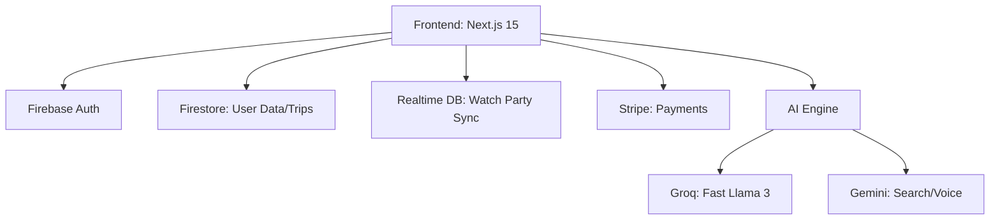

# ✨ StayX - AI-Powered Travel Assistant
### *Your Personal AI Travel Companion for Smarter Journey Planning*
### *رفيقك الشخصي الذكي لتخطيط الرحلات بشكل أفضل*

---

[](https://nextjs.org/)
[](https://www.typescriptlang.org/)
[](https://firebase.google.com/)
[](https://tailwindcss.com/)
[](https://stripe.com/)

---

## 📖 Table of Contents | جدول المحتويات
- [🎯 About | حول المشروع](#-about--حول-المشروع)
- [🌟 Key Features | الميزات الرئيسية](#-key-features--الميزات-الرئيسية)
- [🏗️ Architecture | البنية المعمارية](#-architecture--البنية-المعمارية)
- [🛠️ Tech Stack | مكدس التكنولوجيا](#-tech-stack--مكدس-التكنولوجيا)
- [📦 Installation | التثبيت](#-installation--التثبيت)
- [🚀 Quick Start | البدء السريع](#-quick-start--البدء-السريع)
- [🗂️ Project Structure | هيكل المشروع](#-project-structure--هيكل-المشروع)
- [🔌 AI Integration | تكامل الذكاء الاصطناعي](#-ai-integration--تكامل-الذكاء-الاصطناعي)
- [🔐 Security & Payments | الأمان والمدفوعات](#-security--payments--الأمان-والمدفوعات)
- [🌱 Future Roadmap | خارطة الطريق](#-future-roadmap--خارطة-الطريق)

---

## 🎯 About | حول المشروع
**English:** StayX is a next-generation AI travel assistant designed to streamline the entire travel lifecycle. From intelligent voice-based planning to real-time synchronized "Watch Together" travel research, StayX leverages state-of-the-art LLMs (Gemini & Groq) to provide personalized itineraries, budget tracking, and destination insights.

**العربية:** StayX هو مساعد سفر من الجيل القادم مدعوم بالذكاء الاصطناعي، مصمم لتبسيط دورة حياة السفر بالكامل. من التخطيط الصوتي الذكي إلى البحث المتزامن عن السفر "مشاهدة معًا"، يستفيد StayX من أحدث نماذج اللغة (Gemini و Groq) لتقديم جداول سفر مخصصة وتتبع الميزانية ورؤى الوجهات.

---

## 🌟 Key Features | الميزات الرئيسية

### 🤖 AI Intelligence
- **Voice Assistant (StayX Live):** Real-time voice interaction for hands-free planning.
- **AI Planner Pro:** High-end visual itinerary generator with scenic AI images and PDF export.
- **Hybrid AI Engine:** Uses **Groq (Llama 3)** for fast tasks and **Gemini 2.0** for complex reasoning.
- **Google Search Grounding:** Powered by Gemini's real-time web search for the most current travel data (2026 ready).

### ✈️ Travel Planning
- **Interactive Itineraries:** Detailed daily plans with activities, dining, and logistics.
- **Search & Compare:** Real-time price comparison across major platforms (Airbnb, Booking, etc.).
- **Google Maps Integration:** Integrated Places search and Directions for seamless navigation.
- **Quick Add Calendar:** Easily manage appointments and bookings with a glassmorphism UI.

### 👥 Social & Collaboration
- **Watch Together (StayTV):** Synchronized YouTube playback with a shared AI travel bot for group research.
- **Friend Invitations:** Invite friends to join your trips or watch rooms.

### 🛠️ Technical Excellence
- **Firestore Offline Mode:** Powered by `enableIndexedDbPersistence` — access your trips even without internet.
- **PWA Ready:** Installable on mobile/desktop with offline support.
- **Internationalization (i18n):** Full English and Arabic support with RTL layout and Arabic number formatting.
- **Glassmorphism UI:** Modern, premium aesthetic with emerald green accents and responsive CSS Grid layout.

---

## 🏗️ Architecture | البنية المعمارية



---

## 🛠️ Tech Stack | مكدس التكنولوجيا

| Category | Technology |
| :--- | :--- |
| **Framework** | Next.js 15 (App Router) |
| **Language** | TypeScript |
| **Database** | Firestore & Realtime Database |
| **Auth** | Firebase Auth (Google Login) |
| **AI Models** | Gemini 2.0 Flash, Llama 3 (via Groq) |
| **Styling** | Tailwind CSS 4, Framer Motion |
| **Payments** | Stripe |
| **PWA** | next-pwa |

---

## 📦 Installation | التثبيت

### Prerequisites
- Node.js v20+
- Firebase Project
- Groq & Gemini API Keys

### Setup
1. **Clone & Install**
   ```bash
   git clone https://github.com/yourusername/StayX.git
   cd StayX
   npm install
   ```

2. **Environment Variables**
   Create a `.env.local` file:
   ```env
   NEXT_PUBLIC_GEMINI_API_KEY=your_key
   GROQ_API_KEY=your_key
   NEXT_PUBLIC_STRIPE_PUBLIC_KEY=your_key
   STRIPE_SECRET_KEY=your_key
   # + Firebase Config
   ```

3. **Run Development**
   ```bash
   npm run dev
   ```

---

## 🗂️ Project Structure | هيكل المشروع

- `app/`: Next.js App Router (Routes & API)
- `components/`: Reusable UI components (Dashboard, Planner, WatchRoom)
- `hooks/`: Custom React hooks (useTripPlanner, useI18n)
- `lib/`: Core logic (Firebase, AI wrappers, Travel tools)
- `public/`: Static assets & PWA manifest

---

## 🔌 AI Integration | تكامل الذكاء الاصطناعي

StayX uses a **Hybrid AI Strategy** to balance performance and cost:
- **Groq (Llama 3):** Handles summarization, translation, and basic chat.
- **Gemini 2.0:** Handles voice interaction, search grounding, and complex itinerary generation.

---

## 🔐 Security & Payments | الأمان والمدفوعات

- **Firestore Rules:** Strict default-deny rules with owner-only access.
- **Stripe:** Secure checkout sessions with server-side webhook verification.
- **API Security:** Third-party keys (Groq/Stripe) are kept server-side to prevent exposure.

---

## 🌱 Future Roadmap | خارطة الطريق
- [ ] **Amadeus Integration:** Real flight/hotel booking data.
- [ ] **Offline Maps:** Cached map tiles for PWA users.
- [ ] **Expense Tracker:** Real-time currency conversion and budget alerts.
- [ ] **AI Packing List:** Generated based on destination weather.

---

## 📄 License | الترخيص
MIT License - Copyright (c) 2024 StayX Team.

---

⭐ **Star this repository if you find it useful!**
⭐ **فضلاً ضع نجمة للمستودع إذا وجدته مفيداً!**
